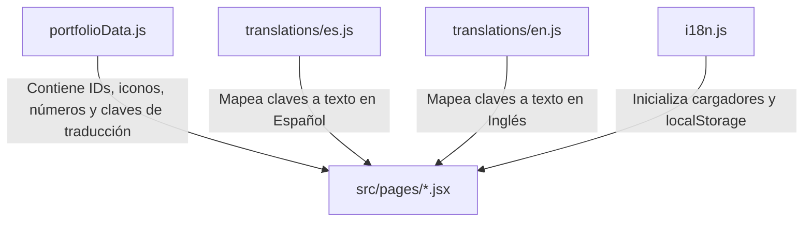

# Manual del Administrador — Portafolio Profesional QA

Este documento es una guía administrativa privada para realizar modificaciones, agregar datos, cambiar el esquema visual, expandir idiomas o desplegar el portafolio en producción.

---

## 🏗️ Estructura de Dependencias de Contenido

El portafolio sigue un patrón de desacoplamiento estricto. La capa de presentación utiliza claves lógicas de traducción (`translationKey`) para renderizar cadenas localizadas.



---

## ✍️ Guía de Modificaciones

### 1. ¿Cómo editar textos generales?
Los textos de la interfaz (títulos de secciones, etiquetas de botones, mensajes de validación) se modifican exclusivamente en:
- `src/data/translations/es.js` (Español)
- `src/data/translations/en.js` (Inglés)

*Ejemplo de adición de clave:*
Si deseas cambiar el saludo inicial del Hero, edita la clave `home.hero_title` en ambos diccionarios.

---

### 2. ¿Cómo agregar o editar Proyectos?
Todos los proyectos se configuran en `src/data/portfolioData.js` dentro del array `projects`.

Cada proyecto tiene la siguiente estructura básica:
```javascript
{
  id: "mi-nuevo-proyecto",
  titleKey: "projects.nuevoproyecto.title",
  category: "Categoría de Prueba",
  descriptionKey: "projects.nuevoproyecto.description",
  demo: "https://midemo.com",
  repository: "https://github.com/usuario/repo",
  integrations: ["Postman", "Cypress", "CI/CD"],
  metrics: {
    coverage: 95,
    improvements: 30,
    riskCoverage: 98,
    findingsCritical: 5,
    bugsResolved: 20,
    ambiguitiesFound: 2,
    qualityImpact: "A"
  },
  enableMetrics: true,
  translationKey: "projects.nuevoproyecto"
}
```

**Paso Obligatorio:** Posteriormente, debes agregar las traducciones correspondientes en `es.js` y `en.js`:
```javascript
// En es.js:
projects: {
  // ...
  nuevoproyecto: {
    title: "Mi Nuevo Proyecto Automático",
    description: "Breve resumen explicativo...",
    strategy_summary: "Detalle de estrategia de prueba...",
    risks: "1. Riesgo A\n2. Riesgo B",
    bugs_detailed: "1. Bug A\n2. Bug B"
  }
}
```

---

### 3. ¿Cómo agregar o editar Certificaciones?
Las certificaciones se configuran en el array `certifications` de `src/data/portfolioData.js`.

```javascript
{
  id: "cert-id",
  titleKey: "certs.nombrecert.title",
  authority: "Entidad Emisora",
  image: "URL_DE_IMAGEN_O_PATH_LOCAL",
  tools: ["Herramienta A", "Herramienta B"],
  integrations: ["Integración A"],
  translationKey: "certs.nombrecert"
}
```

Debes agregar el mapeo de textos correspondientes en los diccionarios `es.js` y `en.js`:
```javascript
certs: {
  nombrecert: {
    title: "Título de la Certificación",
    desc: "Resumen detallado de los conocimientos adquiridos..."
  }
}
```

---

### 4. ¿Cómo agregar o editar Documentación QA?
Las plantillas de documentación interactiva que se muestran en el módulo `/documentation` se estructuran en `src/data/portfolioData.js` bajo `documentation.templates`.

Puedes modificar los parámetros estructurales (`parameters`) y las preguntas auditoras (`questions`) directamente como cadenas de texto no localizadas (ya que suelen ser especificaciones técnicas universales), o bien añadir claves de traducción si el cliente final lo requiere.

---

### 5. ¿Cómo cambiar colores y estilos globales?
La paleta se encuentra centralizada en `tailwind.config.js` bajo `theme.extend.colors.brand`:
- `ash`: Gris ceniza (niveles 50 a 900).
- `navy`: Azul marino (niveles 50 a 950).
- `electric`: Azul eléctrico.
- `lilac`: Lila.

Si deseas modificar el color de acento principal (por ejemplo, el azul eléctrico), cambia el valor hexadecimal en `brand.electric.500`. Tailwind propagará el cambio a todos los componentes que usen clases como `text-brand-electric-500` o `bg-brand-electric-500`.

---

### 6. ¿Cómo agregar un nuevo Idioma (ej. Portugués)?
1. Crea el diccionario correspondiente: `src/data/translations/pt.js`.
2. Exporta el objeto con la misma estructura exacta de claves que `es.js`.
3. Importa el diccionario en `src/i18n.js`:
   ```javascript
   import { pt } from './data/translations/pt.js';
   ```
4. Agrega el recurso dentro de la configuración de `i18n.init`:
   ```javascript
   resources: {
     es: { translation: es },
     en: { translation: en },
     pt: { translation: pt }
   }
   ```
5. El selector de idioma en `Navbar.jsx` detectará automáticamente o puedes adaptarlo para ciclar entre los tres lenguajes disponibles.

---

## 🚀 Plan de Despliegue en Vercel

1. Asegúrate de tener instalado el CLI de Vercel globalmente o vía PNPM:
   ```bash
   pnpm add -g vercel
   ```
2. Ejecuta una compilación local para verificar que no haya lints ni errores de compilación:
   ```bash
   pnpm run build
   ```
3. Ejecuta `vercel` para subir un despliegue de staging y previsualizar en la nube.
4. Si todo es correcto, promueve a producción mediante:
   ```bash
   vercel --prod
   ```
Vercel configurará automáticamente el SPA basándose en las reglas del archivo [vercel.json](file:///C:/Users/ambar/.gemini/antigravity-ide/scratch/qa-portfolio/vercel.json) para asegurar que el enrutador de React Router no devuelva errores 404 al recargar páginas internas.
