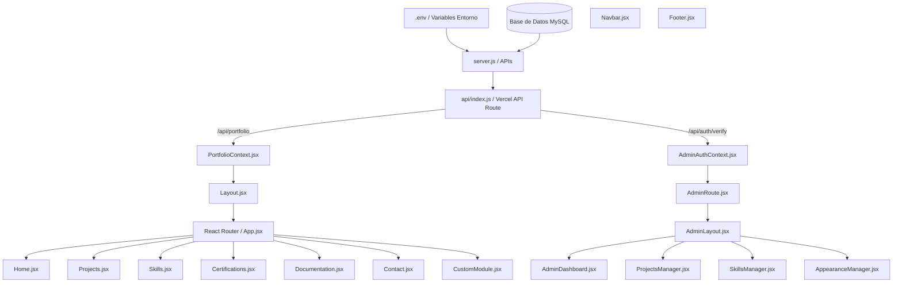

# Arquitectura Técnica de Módulos — Portafolio Profesional QA

Este documento detalla la estructura, lógica y comunicación de los módulos que componen el Portafolio Profesional QA. Sirve como referencia técnica para mantenimiento futuro y análisis de impacto ante refactorizaciones.

---

## 🏗️ Módulos del Sistema

A continuación se detalla cada uno de los 14 módulos del ecosistema, abarcando su descripción, componentes, lógica de estados y persistencia.

---

### 1. Dashboard (Backoffice)
*   **Descripción funcional:** Panel administrativo central que provee un resumen del estado del sistema, acceso rápido a configuraciones y auditoría de logs.
*   **Responsabilidad técnica:** Coordina la navegación del panel de control, muestra métricas agregadas (número de proyectos, habilidades, certificaciones) y despliega logs de error recientes.
*   **Componentes internos:**
    *   `AdminDashboard.jsx` (Vista principal)
    *   `AdminLayout.jsx` (Layout administrativo con barra lateral)
*   **Estados:**
    *   `Loading`: Espera de carga inicial de datos desde `/api/portfolio`.
    *   `Error`: Fallo en la comunicación con el servidor (`DB-500` o `Server-500`).
*   **Dependencias:** `Backoffice Auth`, `PortfolioContext`.
*   **Dependencias inversas:** Ninguna (módulo final de consumo).
*   **Archivos principales:**
    *   [AdminDashboard.jsx](file:///c:/Users/ambar/.gemini/antigravity-ide/scratch/qa-portfolio/src/admin/AdminDashboard.jsx)
    *   [AdminLayout.jsx](file:///c:/Users/ambar/.gemini/antigravity-ide/scratch/qa-portfolio/src/admin/AdminLayout.jsx)
*   **Flujo de datos:** 
    `PortfolioContext (Carga global)` → `Renderizado de contadores` → `Peticiones de re-conexión si falla la DB`.
*   **Integración con Backoffice:** Es el núcleo operativo del Backoffice.

---

### 2. General
*   **Descripción funcional:** Módulo para la configuración básica del sitio (título del sitio, tagline, CV adjunto, geolocalización e información personal básica).
*   **Responsabilidad técnica:** Controla la metadata global de presentación del portafolio y los enlaces de descarga directa del CV.
*   **Componentes internos:**
    *   `GeneralConfig.jsx` (Formularios de datos generales y SEO)
*   **Estados:**
    *   `Submitting`: Estado de bloqueo de botones al guardar cambios.
    *   `Success`: Notificación toast de guardado correcto.
*   **Dependencias:** `PortfolioContext`, `ToastContext`.
*   **Dependencias inversas:** `Home / Hero`, `Footer`, `SEO`.
*   **Archivos principales:**
    *   [GeneralConfig.jsx](file:///c:/Users/ambar/.gemini/antigravity-ide/scratch/qa-portfolio/src/admin/GeneralConfig.jsx)
    *   [db.js](file:///c:/Users/ambar/.gemini/antigravity-ide/scratch/qa-portfolio/src/config/db.js) (Tabla `personal_info`)
*   **Flujo de datos:** 
    `Input formulario` → `Validación Zod` → `Petición PUT a /api/admin/personal` → `Actualización del PortfolioContext` → `Refresco visual en cabeceras y vistas públicas`.
*   **Integración con Backoffice:** Modifica de forma persistente la información expuesta en el Hero y detalles personales de la página principal.

---

### 3. Projects
*   **Descripción funcional:** Catálogo interactivo de proyectos de ingeniería QA (casos de estudio de automatización, pruebas de API, etc.) con métricas específicas de cobertura, defectos resueltos e impacto de calidad.
*   **Responsabilidad técnica:** Renderiza la cuadrícula de proyectos funcionales, controla los accesos a los detalles de cada proyecto y las métricas asociadas.
*   **Componentes internos:**
    *   `Projects.jsx` (Página pública de la cuadrícula de proyectos)
    *   `ProjectDetail.jsx` (Página pública con el caso de estudio extendido, estrategias, riesgos y bugs)
    *   `ProjectsManager.jsx` (Gestión administrativa CRUD)
*   **Estados:**
    *   `Active`: Proyecto visible.
    *   `Maintenance`: Tarjeta bloqueada que avisa fase de pruebas activas.
    *   `Learning`: Tarjeta con barra de progreso de estudio.
*   **Dependencias:** `PortfolioContext`, `StatusCard`.
*   **Dependencias inversas:** `Navigation` (rutas `/projects/:id`).
*   **Archivos principales:**
    *   [Projects.jsx](file:///c:/Users/ambar/.gemini/antigravity-ide/scratch/qa-portfolio/src/pages/Projects.jsx)
    *   [ProjectDetail.jsx](file:///c:/Users/ambar/.gemini/antigravity-ide/scratch/qa-portfolio/src/pages/ProjectDetail.jsx)
    *   [ProjectsManager.jsx](file:///c:/Users/ambar/.gemini/antigravity-ide/scratch/qa-portfolio/src/admin/sections/ProjectsManager.jsx)
*   **Flujo de datos:** 
    `Administración (CRUD)` → `Base de datos (projects)` → `PortfolioContext` → `Projects.jsx (Tarjeta cliqueable)` → `Navegación a detalle de proyecto`.
*   **Integración con Backoffice:** Permite agregar nuevos proyectos que inmediatamente aparecen en la página principal con sus gráficos y métricas dinámicas de calidad.

---

### 4. Skills
*   **Descripción funcional:** Visualización del stack tecnológico del ingeniero (automatización, bases de datos, metodologías).
*   **Responsabilidad técnica:** Controla el inventario de habilidades, niveles de competencia (porcentajes) y herramientas relacionadas.
*   **Componentes internos:**
    *   `Skills.jsx` (Vista pública con modales de detalle)
    *   `SkillsManager.jsx` (CRUD administrativo y funcionalidad Drag-and-Drop de ordenación)
*   **Estados:**
    *   `Loading`/`Saving`: Al reordenar o guardar.
*   **Dependencias:** `@dnd-kit/core`, `@dnd-kit/sortable`, `PortfolioContext`.
*   **Dependencias inversas:** `Projects` (relación de tecnologías).
*   **Archivos principales:**
    *   [Skills.jsx](file:///c:/Users/ambar/.gemini/antigravity-ide/scratch/qa-portfolio/src/pages/Skills.jsx)
    *   [SkillsManager.jsx](file:///c:/Users/ambar/.gemini/antigravity-ide/scratch/qa-portfolio/src/admin/sections/SkillsManager.jsx)
*   **Flujo de datos:** 
    `Reordenamiento Drag & Drop` → `Petición PUT a /api/admin/skills/reorder` → `Prioridad en base de datos` → `Renderizado ordenado`.

---

### 5. Certifications
*   **Descripción funcional:** Galería de certificaciones profesionales de QA y frameworks tecnológicos.
*   **Responsabilidad técnica:** Almacena y renderiza imágenes de certificados, entidades emisoras, fechas y enlaces de verificación.
*   **Componentes internos:**
    *   `Certifications.jsx` (Visualizador público con zoom)
    *   `CertificationsManager.jsx` (Formularios de administración y Drag-and-Drop)
*   **Estados:**
    *   `Active` / `Inactive` / `Learning`
*   **Dependencias:** `PortfolioContext`.
*   **Dependencias inversas:** Ninguna.
*   **Archivos principales:**
    *   [Certifications.jsx](file:///c:/Users/ambar/.gemini/antigravity-ide/scratch/qa-portfolio/src/pages/Certifications.jsx)
    *   [CertificationsManager.jsx](file:///c:/Users/ambar/.gemini/antigravity-ide/scratch/qa-portfolio/src/admin/sections/CertificationsManager.jsx)
*   **Flujo de datos:** 
    `CRUD Administrativo` → `Persistencia en DB` → `Renderizado con zoom interactivo en frontend`.

---

### 6. Documentation
*   **Descripción funcional:** Módulo interactivo de plantillas técnicas de aseguramiento de calidad (Planes de Prueba, Reportes de Bugs estructurados, Checklists de Refinamiento).
*   **Responsabilidad técnica:** Provee un visualizador dinámico con copiado rápido al portapapeles y llenado de parámetros comunes.
*   **Componentes internos:**
    *   `Documentation.jsx` (Visor y parametrizador público)
    *   `DocumentationManager.jsx` (Edición de preguntas, checklist y guías metodológicas)
*   **Estados:**
    *   `Copied`: Estado efímero tras copiar plantilla al portapapeles.
*   **Dependencias:** `PortfolioContext`, `lucide-react`.
*   **Dependencias inversas:** Ninguna.
*   **Archivos principales:**
    *   [Documentation.jsx](file:///c:/Users/ambar/.gemini/antigravity-ide/scratch/qa-portfolio/src/pages/Documentation.jsx)
    *   [DocumentationManager.jsx](file:///c:/Users/ambar/.gemini/antigravity-ide/scratch/qa-portfolio/src/admin/sections/DocumentationManager.jsx)

---

### 7. Contact
*   **Descripción funcional:** Formulario de comunicación directa para potenciales clientes, reclutadores o auditores de calidad.
*   **Responsabilidad técnica:** Valida la información del remitente, sanitiza los campos de entrada contra inyecciones XSS y procesa el envío de correos utilizando `nodemailer`. Adicionalmente, guarda un respaldo local en la base de datos.
*   **Componentes internos:**
    *   `Contact.jsx` (Formulario interactivo de frontend)
    *   `ContactManager.jsx` (Edición administrativa de los datos de contacto y redes sociales)
*   **Estados:**
    *   `Submitting`: Bloqueo de UI durante la petición HTTP de envío.
    *   `Success`: Mensaje "Mensaje enviado correctamente..." en la interfaz.
    *   `Error`: Mensaje "No se pudo enviar el mensaje. Inténtalo nuevamente..." ante fallos.
*   **Dependencias:** `react-hook-form`, `zod`, `nodemailer`.
*   **Dependencias inversas:** `Navbar`, `Footer` (consumo de redes sociales).
*   **Archivos principales:**
    *   [Contact.jsx](file:///c:/Users/ambar/.gemini/antigravity-ide/scratch/qa-portfolio/src/pages/Contact.jsx)
    *   [ContactManager.jsx](file:///c:/Users/ambar/.gemini/antigravity-ide/scratch/qa-portfolio/src/admin/sections/ContactManager.jsx)
    *   [mail.js](file:///c:/Users/ambar/.gemini/antigravity-ide/scratch/qa-portfolio/src/config/mail.js)
*   **Flujo de datos:** 
    `Inputs del Usuario` → `Validación Zod (Cliente)` → `POST a /api/contact` → `IP Rate-limiter (Servidor)` → `Sanitización & Honeypot (Servidor)` → `Persistencia en DB (contact_messages)` → `Envío SMTP a ccc@gmail.com` → `Confirmación visual en Cliente`.

---

### 8. Appearance
*   **Descripción funcional:** Módulo para la edición estética y visual del portafolio en tiempo real.
*   **Responsabilidad técnica:** Controla colores de fondo, acentos, degradados, partículas interactivas del Hero y estilos de tarjetas (ej. glassmorphism).
*   **Componentes internos:**
    *   `AppearanceManager.jsx` (Selector de temas, colores y efectos)
*   **Estados:**
    *   Manejo de variables CSS inyectadas en el `:root` del DOM.
*   **Dependencias:** `ThemeContext`, `PortfolioContext`.
*   **Dependencias inversas:** `Layout.jsx` (inyección dinámica de variables).
*   **Archivos principales:**
    *   [AppearanceManager.jsx](file:///c:/Users/ambar/.gemini/antigravity-ide/scratch/qa-portfolio/src/admin/sections/AppearanceManager.jsx)
    *   [Layout.jsx](file:///c:/Users/ambar/.gemini/antigravity-ide/scratch/qa-portfolio/src/components/Layout.jsx) (Efecto `useEffect` de inyección de estilos)

---

### 9. Navigation
*   **Descripción funcional:** Gestión de elementos de la barra de navegación del sitio.
*   **Responsabilidad técnica:** Controla qué secciones públicas están activas, sus nombres expuestos y el orden de despliegue.
*   **Componentes internos:**
    *   `Navbar.jsx` (Componente de UI público con lógica de overflow para agrupar más de 5 enlaces en "More")
    *   `NavbarManager.jsx` (CRUD de enlaces de navegación y reordenación)
*   **Estados:**
    *   `Active` / `Inactive` / `Maintenance` / `Creative` (Estado de proceso creativo que muestra una pantalla bloqueada personalizada).
*   **Dependencias:** `PortfolioContext`.
*   **Dependencias inversas:** `Layout` (evaluación de estado de páginas).
*   **Archivos principales:**
    *   [Navbar.jsx](file:///c:/Users/ambar/.gemini/antigravity-ide/scratch/qa-portfolio/src/components/Navbar.jsx)
    *   [NavbarManager.jsx](file:///c:/Users/ambar/.gemini/antigravity-ide/scratch/qa-portfolio/src/admin/sections/NavbarManager.jsx)

---

### 10. Modules (Dynamic Modules)
*   **Descripción funcional:** Creación dinâmica de nuevas secciones del portafolio directamente desde el Backoffice (ej. métricas estadísticas, grids).
*   **Responsabilidad técnica:** Genera metadatos dinámicos y, si el usuario lo requiere, escribe plantillas de componentes `.jsx` en el servidor usando APIs de file writing.
*   **Componentes internos:**
    *   `CustomModule.jsx` (Lector de módulos personalizados en la vista pública)
    *   `ModulesManager.jsx` (Creador de módulos con inyección de elementos JSON)
*   **Estados:**
    *   `Pending Config` / `Configured`
*   **Dependencias:** `PortfolioContext`.
*   **Dependencias inversas:** `App.jsx` (enrutado dinámico `/modules/:id`).
*   **Archivos principales:**
    *   [CustomModule.jsx](file:///c:/Users/ambar/.gemini/antigravity-ide/scratch/qa-portfolio/src/pages/CustomModule.jsx)
    *   [ModulesManager.jsx](file:///c:/Users/ambar/.gemini/antigravity-ide/scratch/qa-portfolio/src/admin/sections/ModulesManager.jsx)

---

### 11. About
*   **Descripción funcional:** Sección extendida con los pilares del enfoque de calidad (prevención, comunicación, automatización).
*   **Responsabilidad técnica:** Gestiona e ilustra la biografía profesional, los pilares del testing y la visión laboral del ingeniero.
*   **Componentes internos:**
    *   `About.jsx` (Página pública)
    *   `AboutMeManager.jsx` (Administrador de pilares)
*   **Estados:**
    *   `Active` / `Inactive`
*   **Dependencias:** `PortfolioContext`.
*   **Dependencias inversas:** Ninguna.
*   **Archivos principales:**
    *   [About.jsx](file:///c:/Users/ambar/.gemini/antigravity-ide/scratch/qa-portfolio/src/pages/About.jsx)
    *   [AboutMeManager.jsx](file:///c:/Users/ambar/.gemini/antigravity-ide/scratch/qa-portfolio/src/admin/sections/AboutMeManager.jsx)

---

### 12. Home / Hero
*   **Descripción funcional:** Pantalla de bienvenida con la tarjeta de presentación, rol principal del ingeniero y un panel de estadísticas rápidas de QA (bugs reportados, cobertura, etc.).
*   **Responsabilidad técnica:** Renderiza efectos visuales interactivos y muestra los datos iniciales de impacto.
*   **Componentes internos:**
    *   `Home.jsx` (Página principal pública)
*   **Estados:**
    *   `Active`
*   **Dependencias:** `PortfolioContext`, `framer-motion`.
*   **Dependencias inversas:** Ninguna.
*   **Archivos principales:**
    *   [Home.jsx](file:///c:/Users/ambar/.gemini/antigravity-ide/scratch/qa-portfolio/src/pages/Home.jsx)

---

### 13. Footer
*   **Descripción funcional:** Pie de página con copyright, créditos y accesos directos a redes.
*   **Responsabilidad técnica:** Muestra textos fijos e información legal del portafolio.
*   **Componentes internos:**
    *   `Footer.jsx` (Componente visual fijo)
*   **Estados:** Ninguno (Estático).
*   **Dependencias:** `PortfolioContext`.
*   **Dependencias inversas:** `Layout.jsx`.
*   **Archivos principales:**
    *   [Footer.jsx](file:///c:/Users/ambar/.gemini/antigravity-ide/scratch/qa-portfolio/src/components/Footer.jsx)

---

### 14. Backoffice Auth
*   **Descripción funcional:** Módulo de seguridad, inicio de sesión y validación de tokens JWT de administración.
*   **Responsabilidad técnica:** Valida contraseñas, genera tokens y intercepta accesos a endpoints `/api/admin/*`.
*   **Componentes internos:**
    *   `AdminLogin.jsx` (Formulario de login del Backoffice)
    *   `AdminRoute.jsx` (Guardia de protección de enrutamiento)
    *   `AdminAuthContext.jsx` (Proveedor de estado de autenticación en sesión)
*   **Estados:**
    *   `loadingAuth`: Determina si se está validando el token contra el backend. Previene redirecciones erróneas en refrescos de página.
    *   `isAuthenticated`: Indica si la sesión administrativa es válida.
*   **Dependencias:** `express` (servidor), `jsonwebtoken`, `bcryptjs`.
*   **Dependencias inversas:** Todos los componentes administradores en `src/admin/*`.
*   **Archivos principales:**
    *   [AdminLogin.jsx](file:///c:/Users/ambar/.gemini/antigravity-ide/scratch/qa-portfolio/src/admin/AdminLogin.jsx)
    *   [AdminRoute.jsx](file:///c:/Users/ambar/.gemini/antigravity-ide/scratch/qa-portfolio/src/admin/AdminRoute.jsx)
    *   [AdminAuthContext.jsx](file:///c:/Users/ambar/.gemini/antigravity-ide/scratch/qa-portfolio/src/context/AdminAuthContext.jsx)
*   **Flujo de datos:** 
    `Usuario/Password` → `Cotejo bcrypt contra base de datos (o credenciales fallback en .env si la DB está caída)` → `Generación JWT (Servidor)` → `Almacenamiento en sessionStorage (Cliente)` → `Header Authorization Bearer en peticiones subsequentes`.

---

## 📊 Diagrama de Dependencias y Flujos

---

## 🔍 Análisis de Riesgos y Dependencias Críticas

1.  **Dependencias Críticas:**
    *   `PortfolioContext.jsx`: Es el corazón del estado del frontend. Cualquier fallo o error de tipado al estructurar los datos del contexto provocará pantallas en blanco a nivel global.
    *   `server.js`: Centraliza las operaciones CRUD. La inyección de Middlewares debe ser ordenada (especialmente CORS y cabeceras de seguridad CSP) para no bloquear las solicitudes legítimas de llamadas desde Vercel.
2.  **Riesgos de Cambios:**
    *   **Enlaces Anidados en Cards:** Modificar el comportamiento de la tarjeta de proyectos para que sea totalmente cliqueable requiere remover los enlaces `<Link>` del footer interno. Dejar enlaces anidados rompería la semántica del DOM y causaría comportamientos inesperados en navegadores móviles (desdoblamiento de clics).
    *   **Enrutamiento SPA en Producción (Vercel):** La exclusión de la ruta `/api/*` de las reglas de reescritura es fundamental. Si una actualización en `vercel.json` anula la redirección de APIs al serverless, el sistema de administración fallará inmediatamente al retornar HTML en lugar de JSON.
3.  **Impacto de Refactorización:**
    *   Cualquier alteración en los esquemas de tablas SQL requiere actualizar la lógica de inicialización en `src/config/db.js` y el formateador de respuestas en `server.js` (como parseos de JSON).
